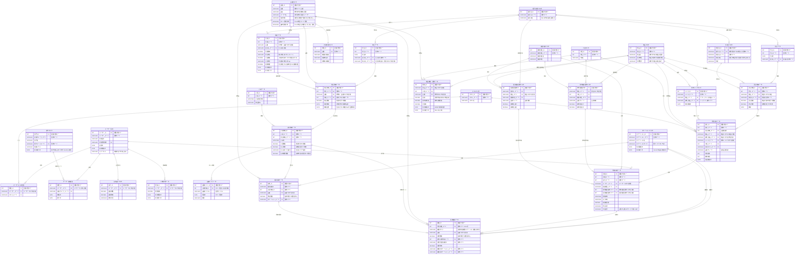

# 製造業データモデル 設計図 (Target ER Diagram)

将来的に目指す完成想定図（Target State）のER図です。
ここに記載されたモデルを元に、要件定義とDBMLへの変換を進めていきます。

```mermaid
erDiagram
%% 製造業データモデル ER図 - Version 1.0

%% -------------------- I. 基礎・取引先マスタ --------------------
"商品マスタ" {
    INT 商品_ID PK "連番 内部キー"
    VARCHAR 商品_コード "業務コード" 
    VARCHAR 商品名 "基材または完成品を登録"
    VARCHAR 在庫単位 "商品の在庫 出荷管理単位"
    VARCHAR 状態区分 "基材 半商品 完成品など"
}

"工程マスタ" {
    INT 工程_ID PK "連番 内部キー"
    INT 工程_コード "業務コード"
    VARCHAR 工程名
}

"スキルマスタ" {
    INT スキル_ID PK "連番 内部キー"
    VARCHAR スキル_コード "業務コード"
    VARCHAR スキル名
}

"相手先名称マスタ" {
    INT 取引先_ID PK "連番 内部キー"
    VARCHAR 取引先_コード "業務コード"
    VARCHAR 取引先名 "仕入先や得意先を兼ねる"
}

"発送先マスタ" {
    INT 発送先_ID PK "連番 内部キー"
    VARCHAR 取引先_コード FK "親得意先または親仕入先 業務コード"
    VARCHAR 発送先_コード "業務コード"
    VARCHAR 発送先名 "自社の納品拠点を登録する場合もある"
    VARCHAR 住所
}

"部門マスタ" {
    INT 部門_ID PK "連番 内部キー"
    VARCHAR 所属グループ_コード "業務コード"
    VARCHAR 部門名
    VARCHAR 親グループ_コード FK "業務コード"
    VARCHAR 階層レベル
    DATE 有効終了日 "部門が廃止された日付 NULLなら有効"
}

"ロケーションマスタ" {
    INT ロケーション_ID PK "連番 内部キー"
    VARCHAR ロケーション_コード "業務コード"
    VARCHAR ロケーション名
    VARCHAR ロケーションタイプ "棚 ラック フロアなど"
    DATE 有効開始日
    DATE 有効終了日 "NULLの場合は現在有効"
}

"品番マスタ" {
    INT 品番_ID PK "連番 内部キー"
    VARCHAR 品番 "業務コード 品番"
    VARCHAR 品名 "原材料や消費財を登録"
    VARCHAR メーカー名 "対象資材の製造元メーカー"
    VARCHAR 在庫単位 "消費 在庫管理で使用する単位 例: g"
    BOOLEAN ロット管理対象 "Trueの場合 ロット管理"
    BOOLEAN 倉庫管理対象 "Trueの場合 在庫数を「まとめ」管理"
}

"技術情報マスタ" {
    INT 技術_ID PK "連番 内部キー"
    VARCHAR 品番 FK "業務コード"
    VARCHAR 推奨保管温度
    VARCHAR 危険物区分
    INT 消費有効期限
}

%% -------------------- II. 品質基準マスタ --------------------

"検査項目マスタ" {
    INT 検査項目_ID PK "連番 内部キー"
    VARCHAR 検査項目_コード "業務コード"
    VARCHAR 検査項目名
    VARCHAR 検査単位
}

"標準検査基準マスタ" {
    INT 標準検査基準ID PK "連番 内部キー"
    VARCHAR 商品_コード FK "商品マスタを参照"
    INT 工程_コード FK
    VARCHAR 検査項目_コード FK
    VARCHAR 品質グレード "品質等級"
    DECIMAL 基準値_最小
    DECIMAL 基準値_最大
}

"個別検査基準マスタ" {
    INT 個別検査基準ID PK "連番 内部キー"
    VARCHAR 取引先_コード FK
    VARCHAR 商品_コード FK "商品マスタを参照"
    VARCHAR 検査項目_コード FK
    VARCHAR 品質グレード "品質等級"
    DECIMAL 基準値_最小
    DECIMAL 基準値_最大
}

%% -------------------- III. ユーザー・原価・レシピマスタ --------------------
"ユーザーマスタ" {
    INT ユーザー_ID PK "連番 内部キー"
    VARCHAR ユーザー_コード "業務コード"
    VARCHAR 資源区分
    VARCHAR 資産管理番号 FK
    DATE 取得日
    DATE 使用開始日
    VARCHAR ステータス "稼働中 保守中 廃止など"
}

"ユーザースキル関連" {
    INT 関連_ID PK "連番 内部キー"
    VARCHAR ユーザー_コード FK "ユーザーマスタを参照" 
    VARCHAR スキル_コード FK  
}

"ユーザー所属履歴" {
    INT 履歴_ID PK "連番 内部キー"
    VARCHAR ユーザー_コード FK "ユーザーマスタを参照"
    VARCHAR 所属グループ_コード FK
    DATE 開始日
    DATE 終了日
}

"設備会計マスタ" {
    INT 会計_ID PK "連番 内部キー"
    VARCHAR ユーザー_コード FK "ユーザーマスタを参照"
    DECIMAL 取得価額
    DECIMAL 設備費率
    VARCHAR 償却方法
}

"人員賃率データ" {
    INT 賃率_ID PK "連番 内部キー"
    VARCHAR ユーザー_コード FK "ユーザーマスタを参照"
    DECIMAL 標準賃率
    DATE 有効開始日
    DATE 有効終了日
}

"標準レシピマスタ" {
    INT レシピ_ID PK "連番 内部キー"
    VARCHAR レシピ_コード "業務コード"
    VARCHAR 商品_コード FK "アウトプット 完成品コード"
    VARCHAR 基材_商品_コード FK "インプット 基材コード"
    DATE 有効開始日
}

"商品構成・消費データ" {
    INT 構成_ID PK "連番 内部キー"
    VARCHAR 商品_コード FK "商品マスタを参照"
    INT 工程_コード FK
    VARCHAR 品番 FK "原材料マスタを参照"
    DECIMAL 面積 "消費材を使用する単位面積"
    DECIMAL 標準消費量 "標準消費数量"
    DECIMAL 歩留率
    DATE 有効開始日 "BOMの有効開始日"
    DATE 有効終了日 "NULLなら現行"
}

%% -------------------- IV. 仕入・在庫管理トランザクション --------------------

"見積データ" {
    INT 見積_ID PK "連番 内部キー"
    INT 見積_コード "業務コード"
    VARCHAR 品番 FK "原材料・品番マスタを参照"
    VARCHAR 取引先_コード FK "仕入先を参照"
    DECIMAL 見積単価
    VARCHAR 発注単位 "購入単位 (例: 缶, パレット)"
    DECIMAL 入目数量 "1発注単位あたりの内容量 (例: 15)"
    VARCHAR 入目単位 "内容量の単位 (例: kg)"
    DECIMAL 換算係数 "発注単位から在庫単位への換算係数"
    DATE 有効開始日
    DATE 有効終了日
}

"発注データ" {
    INT 発注_ID PK "連番 内部キー"
    INT 発注_コード "業務コード"
    DATE 発注日
    VARCHAR 取引先_コード FK "仕入先の業務コード"
    VARCHAR 納入先_コード FK "自社の納品先（発送先マスタを参照）"
}

"発注明細データ" {
    INT 発注明細_ID PK "連番 内部キー"
    INT 発注_コード FK "業務コード"
    VARCHAR 品番 FK "原材料・品番マスタを参照"
    INT 見積_コード FK "適用される見積データ"
    DECIMAL 発注数量 "発注単位での数量"
    DATE 希望納期 "対象資材の希望納品日"
    DATE 納期回答 "仕入先からの確定および回答納期"
}

"入荷データ" {
    INT 入荷_ID PK "連番 内部キー"
    INT 入荷_コード "業務コード"
    DATETIME 入荷処理日時
    VARCHAR 納品書No
}

"入荷明細データ" {
    INT 入荷明細_ID PK "連番 内部キー"
    INT 入荷_コード FK "業務コード"
    INT 発注明細_コード FK "業務コード"
    DATETIME 入荷日
    DECIMAL 入荷数量 "発注単位での数量"
    DECIMAL 仕入単価 "実際適用された単価"
    VARCHAR 仕入先ロット番号 "仕入先バッチ番号"
    DECIMAL 在庫換算数量 "在庫単位に換算された数量"
}

"品番ロットデータ" {
    INT 品番ロット_ID PK "連番 内部キー"
    INT 入荷明細_ID FK "ロット発生元の入荷明細"
    VARCHAR 品番ロットNo "社内ロットNo"
    DATE 製造日 "ロット製造日"
    VARCHAR 備考
}

"個別在庫データ" {
    INT 在庫_ID PK "連番 内部キー"
    VARCHAR 個別識別子 "業務コード"
    INT 入荷明細_ID FK "業務コード"
    VARCHAR 品番 FK "品番マスタを参照"
    DECIMAL 現在数量 "在庫単位での数量 例: g"
    VARCHAR ロケーション_コード FK "業務コード"
}

"在庫移動データ" {
    INT 移動_ID PK "連番 内部キー"
    INT 作業実績_コード FK "業務コード NULL可"
    VARCHAR 移動タイプ "消費 棚卸調整 ロケーション移動 入庫等"
    VARCHAR 品番 FK "品番マスタを参照"
    DECIMAL 消費数量 "在庫単位での数量 例: g"
    INT 適用入荷明細_コード FK "業務コード"
    VARCHAR 消費元個別識別子 FK "業務コード"
    DECIMAL 消費原価
    VARCHAR 移動元ロケーション_コード FK "業務コード"
    VARCHAR 移動先ロケーション_コード FK "業務コード"
}

%% -------------------- V. 受注・販売管理トランザクション --------------------
"受注データ" {
    INT 受注_ID PK "連番 内部キー"
    INT 受注_コード "業務コード"
    DATE 受注日
    VARCHAR 取引先_コード FK "得意先 業務コード"
}

"受注明細データ" {
    INT 受注明細_ID PK "連番 内部キー"
    INT 受注_コード FK "業務コード"
    VARCHAR 商品_コード FK "商品マスタ 完成品"
    VARCHAR 発送先_コード FK "発送先 業務コード"
    DECIMAL 受注数量 "商品の在庫単位での数量"
    DECIMAL 受注単価 "実際適用された単価"
    DATE 納期
}

%% -------------------- VI. 生産・実績トランザクション --------------------
"作業指示データ" {
    INT 指示_ID PK "連番 内部キー"
    INT 指示_コード "業務コード"
    INT 受注明細_コード FK "生産依頼元"
    VARCHAR 商品_コード FK "商品マスタ 完成品を参照"
    VARCHAR 基材_商品_コード FK "商品マスタ 基材を参照"
    VARCHAR レシピ_コード FK "標準レシピマスタを参照"
    INT 工程_コード FK
    VARCHAR 必須スキル_コード FK
    VARCHAR 品質グレード "指示品質等級"
    INT 作業順序
    INT 標準時間
    DATE 計画開始日
}

"作業実績データ" {
    INT 実績_ID PK "連番 内部キー"
    INT 実績_コード "業務コード"
    INT 指示_コード FK "業務コード"
    VARCHAR ユーザー_コード FK "ユーザーマスタを参照"
    VARCHAR 検査項目_コード FK
    INT 標準検査基準コード FK "標準検査基準マスタを参照"
    INT 個別検査基準コード FK "個別検査基準マスタを参照"
    DATETIME 開始日時
    DATETIME 完了日時
    DECIMAL 検査結果値
    VARCHAR 総合合否
    VARCHAR 不良区分 "合格 不合格スクラップ 手直しなど"
}


%% -------------------- VII. リレーションシップ 定義 --------------------
"相手先名称マスタ" ||--o{ "発送先マスタ" : 複数発送先
"品番マスタ" ||--|| "技術情報マスタ" : 技術情報
"入荷明細データ" ||--o{ "品番ロットデータ" : ロット情報
"商品マスタ" ||--o{ "標準レシピマスタ" : 完成品
"商品マスタ" ||--o{ "標準レシピマスタ" : 基材
"商品マスタ" ||--o{ "商品構成・消費データ" : 構成元
"工程マスタ" ||--o{ "商品構成・消費データ" : 構成
"品番マスタ" ||--o{ "商品構成・消費データ" : 消費品
"商品マスタ" ||--o{ "標準検査基準マスタ" : 適用商品
"工程マスタ" ||--o{ "標準検査基準マスタ" : 適用工程
"検査項目マスタ" ||--o{ "標準検査基準マスタ" : 項目
"相手先名称マスタ" ||--o{ "個別検査基準マスタ" : 適用取引先
"商品マスタ" ||--o{ "個別検査基準マスタ" : 適用商品
"検査項目マスタ" ||--o{ "個別検査基準マスタ" : 項目
"ユーザーマスタ" ||--o{ "ユーザースキル関連" : 所持
"スキルマスタ" ||--o{ "ユーザースキル関連" : 含む 
"ユーザーマスタ" ||--o{ "ユーザー所属履歴" : 所属
"部門マスタ" ||--o{ "ユーザー所属履歴" : 所属グループ
"ユーザーマスタ" ||--|| "設備会計マスタ" : 会計情報
"ユーザーマスタ" ||--o{ "人員賃率データ" : 賃率情報
"相手先名称マスタ" ||--o{ "受注データ" : 得意先
"受注データ" ||--o{ "受注明細データ" : 構成
"商品マスタ" ||--o{ "受注明細データ" : 受注商品
"発送先マスタ" ||--o{ "受注明細データ" : 納入先
"受注明細データ" ||--o{ "作業指示データ" : 依頼元
"標準レシピマスタ" ||--o{ "作業指示データ" : 参照レシピ
"商品マスタ" ||--o{ "作業指示データ" : 対象商品
"工程マスタ" ||--o{ "作業指示データ" : 含む
"スキルマスタ" ||--o{ "作業指示データ" : 必要スキル
"作業指示データ" ||--o{ "作業実績データ" : 実現
"ユーザーマスタ" ||--o{ "作業実績データ" : 実行者
"検査項目マスタ" ||--o{ "作業実績データ" : 記録
"標準検査基準マスタ" ||--o{ "作業実績データ" : 標準基準参照
"個別検査基準マスタ" ||--o{ "作業実績データ" : 個別基準参照
"品番マスタ" ||--o{ "見積データ" : 提供品
"相手先名称マスタ" ||--o{ "見積データ" : 提供元
"相手先名称マスタ" ||--o{ "発注データ" : 発注先
"発注データ" ||--o{ "発注明細データ" : 構成
"品番マスタ" ||--o{ "発注明細データ" : 品番
"見積データ" ||--o{ "発注明細データ" : 適用見積
"発注明細データ" ||--o{ "入荷明細データ" : 該当発注
"入荷データ" ||--o{ "入荷明細データ" : 構成
"ロケーションマスタ" ||--o{ "個別在庫データ" : 配置
"ロケーションマスタ" ||--o{ "在庫移動データ" : 移動元
"ロケーションマスタ" ||--o{ "在庫移動データ" : 移動先
"入荷明細データ" ||--o{ "個別在庫データ" : 発生元
"品番マスタ" ||--o{ "個別在庫データ" : 対象品
"作業実績データ" ||--o{ "在庫移動データ" : 消費元
"品番マスタ" ||--o{ "在庫移動データ" : 消費品
"入荷明細データ" ||--o{ "在庫移動データ" : 原価元ロット
"個別在庫データ" ||--o{ "在庫移動データ" : 原価元個別
```
